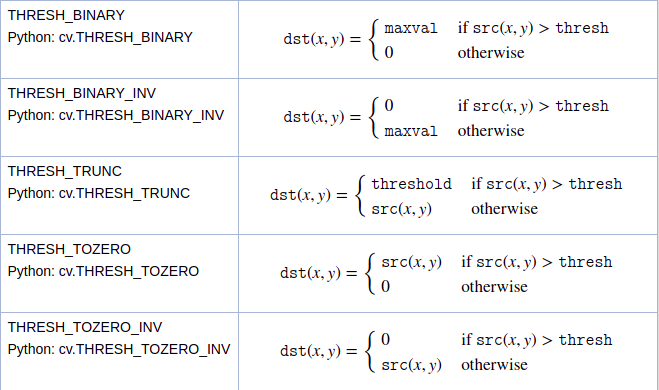

# What is ROS?

## First, what it is not:

Robot Operating System, despite its name, is neither an operating system nor is a framework.

ROS is more of a middleware, something like a low-level “framework” based on an existing operating system. The main supported operating system for ROS is Ubuntu. You have to install ROS on your operating system in order to use it.

Robot Operating System is mainly composed of 2 things:

+ A core (middleware) with communication tools
+ A set of plug & play libraries

Basically, a middleware is responsible for handling the communication between programs in a distributed system.

When developing a new software you can choose to: A. Develop one code base with everything compiling and running in one block, or B. Create sub programs, one for each sub task/functionality of your application.

Without any suspense, the second option is the best when developing a robotics software. You really need to be able to develop one part of your application (let’s say, a driver for a sensor), and run it without the whole application.

So, you’re now writing many small modules, and they need to communicate between each other. ROS core is here to help you do that.

###### Source: https://roboticsbackend.com/what-is-ros/


# Install ROS Melodic on Ubuntu 18.04 - 
*NOTE: Different Ubuntu Versions support different ROS Distributions*

> Eg: Ubuntu 16.04 - Kinetic, Ubuntu 18.04 - Melodic and Ubuntu 20.04 - Noetic.

Run the following in a terminal ->
```bash
sudo sh -c 'echo "deb http://packages.ros.org/ros/ubuntu $(lsb_release -sc) main" > /etc/apt/sources.list.d/ros-latest.list'

sudo apt-key adv --keyserver 'hkp://keyserver.ubuntu.com:80' --recv-key C1CF6E31E6BADE8868B172B4F42ED6FBAB17C654

curl -sSL 'http://keyserver.ubuntu.com/pks/lookup?op=get&search=0xC1CF6E31E6BADE8868B172B4F42ED6FBAB17C654' | sudo apt-key add -

sudo apt update

sudo apt install ros-melodic-desktop-full
```
## Setup Environment
```bash 
echo "source /opt/ros/melodic/setup.bash" >> ~/.bashrc
source ~/.bashrc
```
The reason to add the source in the startup shell script is because ROS depends on the notion of combining spaces using the shell enivronment.

*IF* this ```source  /opt/ros/melodic/setup.bash``` is not added in the bashrc then you have to run this command in every new terminal in order to access the ROS commands. 
## Dependenices Required to Build Packages
```bash
sudo apt install python-rosdep python-rosinstall python-rosinstall-generator python-wstool build-essential
```
Initialise rosdep, which is a tool for checking and installing package dependencies in an OS-independent way -
```bash
sudo rosdep init
rosdep update
```

## Setting up catkin workspace

Essentially, **Catkin** is a bunch of CMake macros(bunch of small programs) that are used to build packages which are used in ROS.

A **catkin workspace** is a folder where you modify, build, and install catkin packages.
```bash
source /opt/ros/melodic/setup.bash
mkdir ~/catkin_ws/src
cd ~/catkin_ws/src
catkin_init_workspace
```

To build workspace:
```bash
cd ~/catkin_ws/
catkin_make
```

Sourcing ROS environment variables
```bash
source ~/catkin_ws/devel/setup.bash
echo $ROS_PACKAGE_PATH # make sure proper environment variables set
```

##  Creating catkin package

```bash
cd ~/catkin_ws/src
catkin_create_pkg <package_name> [depend1] [depend2] [depend3]
cd ~/catkin_ws
catkin_make
```

This will create a similar structure in `~/catkin_ws/devel` as found in `/opt/ros/$ROSDISTRO_NAME`

Sourcing built workspace to ROS environment:
```bash
~/catkin_ws/devel/setup.bash
```

## Building packages in catkin workspace 
```
catkin_make
```

This will build any packages in the source space ```(~/catkin_ws)``` to the build space ```(~/catkin_ws/build)```

---

# ROS Concepts

## Master
One of the basic goals of ROS is to allow developers to write software as a collection of independent small programs that are called as **nodes** that all run simultaneously. 

*For example, in a self-driving car, the movement, image processing, etc. run simultaneously during the drive. These are controlled by independent programs called **nodes**.*
For these nodes to work, they must be able to communicate with each other. This is done through something called as **ROS Master**.

To start master - 
```
roscore
```
You should allow the master to continue running for the entire time that you’re using ROS. One reasonable workflow is to start roscore in one terminal, then open other terminals to continue. There are not many reasons to stop roscore, except when you’ve finished working with ROS. When you reach that point, you can stop the master by typing Ctrl-C in its terminal.

**Most ROS nodes connect to the master when they start up, and do not attempt to reconnect if that connection fails later on. Therefore, if you stop roscore, any other nodes running at the time will be unable to establish new connections, even if you restart roscore later.**

+ **Nodes**: A node is an executable that uses ROS to communicate with other nodes.

+ **Messages**: ROS data type used when subscribing or publishing to a topic.

+ **Topics**: Nodes can publish messages to a topic as well as subscribe to a topic to receive messages.

+ **Services**: Services are another way that nodes can communicate with each other. Services allow nodes to send a request and receive a response.

+ **Parameters**: ```rosparam``` allows you to store and manipulate data on the ROS Parameter Server. The Parameter Server can store integers, floats, boolean, dictionaries, and lists.
---


# [ROS Packages](http://wiki.ros.org/catkin/workspaces)

## What makes up a [catkin package](http://wiki.ros.org/ROS/Tutorials/CreatingPackage)?

```
my_package/
  CMakeLists.txt
  package.xml
```

`package.xml` provides meta information about the package(name, version, maintainer, and dependencies).
`CMakeLists.txt` contains build instructions for CMake, and must use catkin CMake variables.

## Recommended development flow<sup>[[LINK]](http://wiki.ros.org/ROS/Tutorials/NavigatingTheFilesystem)</sup>

Maintain a single development workspace, called 'catkin workspace', containing all catkin packages. Aliased as `catkin_ws` by `setup.bash` (see next section).

```bash
workspace_folder/        -- WORKSPACE
  src/                   -- SOURCE SPACE
    CMakeLists.txt       -- 'Toplevel' CMake file, provided by catkin
    package_1/
      CMakeLists.txt     -- CMakeLists.txt file for package_1
      package.xml        -- Package manifest for package_1
    ...
    package_n/
      CMakeLists.txt     -- CMakeLists.txt file for package_n
      package.xml        -- Package manifest for package_n
    
    build/                  -- BUILD SPACE
      CATKIN_IGNORE         -- Keeps catkin from walking this directory
    devel/                  -- DEVELOPMENT SPACE (set by CATKIN_DEVEL_PREFIX)
      bin/
      etc/
      include/
      lib/
      share/
      .catkin
      env.bash
      setup.bash
      setup.sh
    ...
    install/                -- INSTALL SPACE (set by CMAKE_INSTALL_PREFIX)
      bin/
      etc/
      include/
      lib/
      share/
      .catkin             
      env.bash
      setup.bash
      setup.sh
    ...
```

# ROS 1: Hello World in ROS!
First create your workspace, after creating workspace go to src and use 
```catkin_create_pkg package-name dependenices seperated by space```
and go back to root and do ```source devel/setup.bash```

By sourcing your setup.bash file, you are adding several environment variables that ROS needs in order to work, after which run ```catkin_make```.

**NOTE:** The difference between CPP and PY files is that for CPP you have to include the excec in the CMake so that the compiler knows it is a CPP file to be converted to an executable. If it is a PY file then you don't have to do anything except for making the file executable by using the following command

```chmod 777 **$path/to/file**```

Go to CMakeLists.txt -> 
```
find_package(catkin REQUIRED dependencies like roscpp rospy)
add_executable(executable_name relative-path to the source-file)
target_link_libraries(executable_name ${catkin_LIBRARIES})
```
Go to package.xml ->

```<build_depend>package-name</build_depend><run_depend>package-name</run_depend>```

package-name means dependencies here - roscpp 

 Once this is done, then we can run roscore and rosrun for the respective publisher and subscriber.
 
```rosrun package-name(project name) executable_name```

## Example
```bash
cd ~/catkin-ws/src/
catkin_create_pkg agitr roscpp
cd ~/catkin-ws/
source devel/setup.bash
catkin_make
cd ~/catkin-ws/src/agitr/src/
touch hello.cpp
```
Write the required [code](src/hello.cpp).

In CMakeLists.txt ->
```bash
find_package(catkin REQUIRED dependencies roscpp)
add_executable(hello src/hello.cpp)
target_link_libraries(hello ${catkin_LIBRARIES})
```
In package.xml ->
```
<build_depend>roscpp</build_depend><run_depend>roscpp</run_depend>
```
Save all the files.
``` bash
cd ~/catkin-ws/
source devel/setup.bash
catkin_make
```
```roscore``` in a seperate terminal
```
rosrun agitr hello
```

---

# ROS 2: Publisher:
"Node" is the ROS term for an executable that is connected to the ROS network. Here we'll create the publisher ("talker") node which will continually broadcast a message.
## How to send randomly-generated velocity commands to a turtlesim turtle?

First, create the required cpp file, write the required [code](src/random_vel.cpp)->

Go to the CMakeLists ->
```
find_package(catkin REQUIRED dependencies roscpp geometry_msgs)
add_executable(randomv src/random_vel.cpp)
target_link_libraries(randomv ${catkin_LIBRARIES})
```

In package.xml, add ->
```
  <build_depend>geometry_msgs</build_depend> 
  <exec_depend>geometry_msgs</exec_depend>
```
Save all the files.
``` bash
cd ~/catkin-ws/
source devel/setup.bash
catkin_make
```
```roscore``` in a seperate terminal

```rosrun turtlesim turtlesim_node``` in another terminal and finally 
```
rosrun agitr randomv
```
in another terminal obvi rofl

**Errors faced**
1. Valid Characters Error => Cannot use ```.``` in the name of the package in cpp file.

# ROS 3: Subscriber:
As the name suggests it subscribes to a topic that has a publisher publishing message. So essentially, a subscriber can access these published messages without the need to having know who is publishing it.
## Subscribe to pose 
First, create the required cpp file, write the required [code](src/subscriber.cpp)->

While creating a ros::Subscriber object, we do not explicitly
mention the message type anywhere. The C++ compiler infers the correct message type based on the data type of the callback
function pointer we provide, i.e, poseMessageRececive


### Go to the CMakeLists ->
```
add_executable(subscribe_pose src/subscriber.cpp)
target_link_libraries(subscribe_pose ${catkin_LIBRARIES})
```
Save all the files.
``` bash
cd ~/catkin-ws/
source devel/setup.bash
catkin_make
```
```roscore``` in a seperate terminal

```rosrun turtlesim turtlesim_node``` in another terminal and finally 
```
rosrun agitr subscribe_pose
```
in another terminal obvi rofl, you can also run the publisher 
```
rosrun agitr randomv
```
in another terminal :)

**Errors faced**
1. Initially used poseMessageReceive() instead of a pointer: Basically we use pointer because we only want the address of the function and not actually want to call the function!

We can also use poseMessageReceive without the ```&``` -> compiler will interpret it as a pointer itself!

**The question of whether to use ros::spinOnce() or ros::spin() comes down to this: Does your program have any repetitive work to do, other than responding to callbacks? If the answer is “No,” then use ros::spin(). If the answer is “Yes,” then a reasonable option is to write a loop that does that other work and calls ros::spinOnce() periodically to process callbacks!**

---

# ROS 4: Logging

There are 5 levels of logging in order of increasing importance ->

1. DEBUG - reading header from buffer
2. INFO - Waiting for all connections to establish
3. WARN - Less than 5GB of space free on disk
4. ERROR - Publisher header did not have required element: type
5. FATAL - You must call ros::init() before creating the first NodeHandle

```
ROS_DEBUG_STREAM(message);
ROS_INFO_STREAM(message);
ROS_WARN_STREAM(message);
ROS_ERROR_STREAM(message);
ROS_FATAL_STREAM(message);
```
ROS also provides shorthand macros that generate precisely these sorts of one-time only log messages.
```
ROS_DEBUG_STREAM_ONCE(message);
ROS_INFO_STREAM_ONCE(message);
ROS_WARN_STREAM_ONCE(message);
ROS_ERROR_STREAM_ONCE(message);
ROS_FATAL_STREAM_ONCE(message);
```

The interval parameter is a double that specifies the minimum amount of time, measured in seconds, that must pass between successive instances of the given log message
```
ROS_DEBUG_STREAM_THROTTLE(interval, message);
ROS_INFO_STREAM_THROTTLE(interval, message);
ROS_WARN_STREAM_THROTTLE(interval, message);
ROS_ERROR_STREAM_THROTTLE(interval, message);
ROS_FATAL_STREAM_THROTTLE(interval, message);
```
### These log messages are actually in 3 different destinations, namely -> output on console, as a message on rosout topic and as an entry in a log file
1. We essentially publish logs to /rosout topic because all the log messages irrespective of its nodes, subscribers, locations all of them are logged into rosout! We can view this using 
```
rostopic echo /rosout (or)
rqt_console
```
>rqt_console actually subscribes to rosout_agg = rosout aggregated -> basically rosout aggregated subscribes to rosout to streamline the publisher scubscriber to one topic instead of many nodes to rosout.

2. The third and final destination for log messages is a log file generated by the rosout node.
As part of its callback function for the /rosout topic, this node writes a line to a file with a
name like this:
```∼/.ros/log/run_id/rosout.log```

To learn the run_id(generated from MAC address and the current time):
```rorparam get /run_id```

---

# ROS 5: Graph Resource Names

## These are essentially names of topics, nodes, services and pararmeters, and how ROS resolves this realtive naming system
> default_namespace + relative_name = globalname 

/turtle1 + cmd_vel = /turtle1/cmd_vel

Private Names - begin with tilde symbol -> The difference is that, instead of using the current default namespace, private
names use the name of their node as a namespace

Anonymous Names - They are used specifically used to name nodes. The purpose
of an anonymous name is to make it easier to obey the rule that each node must have a
unique name.
```
ros::init(argc, argv, base_name, ros::init_options::AnonymousName);
```
>This is to ensure that the name of the node is unique

Output the name on console -
```
ROS_INFO_STREAM( "This message is from "
<<ros::this_node::getName());
```

# ROS 6: Launch Files:

Instead of the need to start so many nodes at once in seperate terminals, there is a solution for it using Launch Files. We can configure the file to start the rosmaster, nodes, etc.

## Remapping - 

To remap names within a launch fie, use a remap element in the node attribute - 
```bash
<node pkg="turtlesim" type="turtlesim_node" name="turtlesim" >
    <remap from="turtle1/pose" to="tim" />
</node>
```

### ERRORS
1. So basically in the [example.launch](launch/example.launch)
 for pkg = "agitr" I had initially put the name of the file -> subscriber.cpp, it doesn't work because it expects an executable-file for that cpp.
2. Use the executable-name used in the [CMake](CMakeLists.txt), i.e, subscribe_pose
3. The name can be anything as it will replace the base_name defined in the *ros::init();*

## Program that subscribes to turtle1/cmd_vel and republishes on turtle1/cmd_vel_reversed

1. Write the [program](src/reverse_cmd_vel.cpp)
2. To include the contents of another launch file, including all of its nodes and parameters, use an *include* element

```
<include file="$(find package-name)/launch-file-name" />
```

---

# ROS 7: Pararmeters

The idea is that a centralized parameter
server keeps track of a collection of values—things like integers, floating point numbers,
strings, or other data—each identified by a short string name.

The parameter is actually a part of the master, so it is started automatically when roscore and roslaunch.


To get information about the parameters use ->
```
rosparam get /
```

## For example, changing the background of the turtlesim
```
rosrun turtlesim turtlesim_node
rosparam get /turtlesim/background_b
rosparam get /turtlesim/background_g
rosparam get /turtlesim/background_r
rosparam set /turtlesim/background_b 255
rosparam set /turtlesim/background_g 245
rosparam set /turtlesim/background_r 0
```
Even after setting these parameters, the background color remains the same
The explanation is that turtlesim_node only reads the values of these parameters
when its /clear service is called.
```
rosservice call /clear
```

## Accessing parameters from C++
The C++ interface to ROS parameters is quite straightforward:
void ros::param::set(parameter_name, input_value);
bool ros::param::get(parameter_name, output_value);

---

# ROS 8: Services

Alternate method of communication apart from messages are *service calls*. It eliminates the limitations that *messages* have.

**Service Calls differ from messages in two ways**
+ Service calls are bi-directional
> One node sends info to another node and expects a respone, while when a message is published, there is no response, in fact there is no guarantee if anyone has subsribed to the messages.

+ Service Calls implement **one-to-one** communication. 
> Each service call is initiated by one node, and the response goes back to that same node. On the other hand, each message is associated with a topic that have many publishers and many subscribers.


Client ---> Server = Request
> Client node sends some data(request) to the server node and waits for the reply(response), now the server takes some action(running a program, computing something, configuring) for the request. 

Server ---> Client = Response
> This "computed" data is sent back to the client as a response

### Service data type is defined by collection of named fields divided into two parts ->
+ Representing the request
+ Response

### Listing all services - ```rossservice list```

### Listing services by node - To see the services offered by one particular node, use the rosnode info command:
```rosnode info node-name```

### Finding a node offering a service - ```rosservice node service-name```

### Finding dtype of a service - ```rosservice info service-name```

## Now lets say we want to write a service that spawns a turtle and moves forward when called the service and rotates when called again.

So we write a client and server code ->

[CLIENT CODE](src/spawn_turtle.cpp)-
[SERVER CODE](src/publevel_toggle.cpp)

*In CMakeLists.txt*->
```
find_package(catkin REQUIRED roscpp turtlesim)
add_executable(publevel_toggle src/publevel_toggle.cpp)
target_link_libraries(publevel_toggle ${catkin_LIBRARIES})
```
*In package.xml*->
```
  <build_depend>turtlesim</build_depend> 
  <exec_depend>turtlesim</exec_depend>
```
In seperate terminals ->
```
roscore
rosrun turtlesim turtlesim_node
rosrun agitr publevel_toggle
rosservice call /toggle_forward
```
---

# ROS 9: Recording and replaying messages using bag files

With rosbag, we can **record** the messages published on one or more topics to a file, and then later **replay** those messages.

The term **bag file** refers to a specially formatted file that stores timestamped ROS messages.

**Recording bag files**: ```rosbag record [parameters]```
**Replaying bag files**: ```rosbag info filename.bag```

## Demonstration -
```
roscore
rosrun turtlesim turtlesim_node
rosrun turtlesim draw_square
```
draws a square continously
```rosbag record -O square.bag /turtle1/cmd_vel /turtle1/pose```
Records the messages into square.bag file
```rosbag play square.bag```
> On playing the rosbag play you'll notice that the turtle will not exactly trace the path of the turtle, instead it'll make a square in a random direction. This is because rosbag only replicates a sequence of messages. It does not replicate the initial conditions.

**NOTE: If we check the messages published on the /turtle1/pose we say that there is a large in the y coordinates. Its because both turtlesim and rosbag play are publishing on the same topic**

---

# ROS 10: OpenCV and ROS

Images are collected by topics that are published by drivers of the camera. So we need to create subscriber in order to receive the image and send to OpenCV for processing. The image format supported by ROS != image supported by OpenCV => CVBridge

> Topic -> ROS Image Message <---> CV Bridge <---> OpenCV cv::Mat

Architecture 👆

### Subscribing to the topic -  */usb_cam/image_raw*
[Subscriber Code in Python](src/scripts/image_pub_sub.py)

### To turn on the camera -
```rosrun usb_cam usb_cam_node _pixel_format:=yuyv```

### Execute the script -
```bash
catkin_make
chmod 777 ~/catkin_ws/src/agitr/src/image_pub_sub.py
rosrun agitr image_pub_sub.py
```
---
# ROS 11: Threshold

##  Simple threshold -> 
if a point(x,y) in the image is > than a threshold value then black else white. It is not effective in all the cases(example bad lighting) so we use Adaptive Thresholding

*Syntax* - ```cv2.threshold(image, threshold_value, 255, cv2.Simple_Threshold_Method)```

Different Simple Threshold Methods - 


## Adaptive Threshold -
The algo calculates the threshold for a small region of the image 
Adaptive Method Types -
1. Adaptive Threshold Mean - threshold value is the mean of the neighbourhood area
2. Adative Threshold Gaussian - threshold value is the weighted sum of neighborhood values where weights are a gaussian window

*Syntax* - 
```
cv2.adaptive_thresholding(gray_image, 255, adaptive_method, block_size, c)
```
> block_size - size of neighborhood area; c - correction factor 

---

# ROS 12: Contour Detection and Ball Tracking

Contours are basically a curve joining all the continous points, works by detecting discontinuities in brightness. 
Generally used to find the boundaries of objects within images.
Algo ->
+ Read image as RGB
+ Convert img to grayscale
+ Convert gray image to binary
+ Find the the contours using ```cv2.findContours()``` on the binary image
+ Process the contours <=> finding its area, enclosing circle, perimeter, moment and centroid

Based on contours hierarchy, there are different methods to find a contour! Commonly used ```retr_list```

[Code](src/scripts/contours_detection.py)

## Processing Contours by finding area, centroid, etc - 
[Code](src/scripts/contours_processing.py)

## Ball detection - 
Essentially, its the same as contour processing, excep that we use a if condition to filter out contours and add relevant lower and upper bound to mask.
[Code](src/scripts/ball_detection.py)

## Ball Tracking - 
Instead of using pictures(frames), we breakdown the livestream/video into frames and process them manually.
[Code](src/scripts/ball_tracking.py)

# ROS 13: Subscribing and Publishing Live Stream Videos in ROS

We do this using CvBridge and OpenCV, but this time in C++, because when we are doing real time execution it is worth the pain using C++.
[Code](src/image_pub_sub.cpp)
To run this program, we'll have to do the following -
```
roscore
rosrun usb_cam usb_cam_node _pixel_format:=yuyv image:=/camera/image-raw
rosrun image_view image_view_node image:=/usb_camera_node/image_raw
rosrun agitr image_pub_sub_cpp image:=/usb_camera_node/image_raw
rosrun image_view image_view2_node image:=/usb_camera_node/output_video
```
So instead of running so many things in 5 terminals simultaneously, we use [Launch Files](#ROS-6:-Launch-Files:) in order to put these commands into a launch file we make node attributes like in our [example.launch](launch/example.launch).

[Image Pub Sub Launch File](launch/image_pub_sub.launch)

So now instead of running the 5 commands we run only one command, i.e,
```
roslaunch agitr image_pub_sub.launch
```
That's it.

# ROS 14: rosserial

If there is a hardware that does not support ROS, then we will need drivers. *Eg: LiDAR's, Depth Cam, etc. have built in drivers so directly compatible with ROS.* 
> For this reason, rosserial was designed to (integration of microcontrollers and embedded systems into ROS)communicate new hardware with ROS. It is a communication protocol.

*rosserial_client* is designed for microcontrollers and it can run on any processor with ANSI C++ compiler and a serial port connection to a PC running ROS.

## ROS-Side Interfaces
+ rosserial_python: A Python-based implementation
+ rosserial_server: A C++ implementation, recommended for high performance applications

**rosserial_python<-->ROS<--ros messages-->rosserial_arduino**

# ROS 15: ROS on Arduino

Install the rosserial libraries - 
```
sudo apt-get install ros-melodic-rosserial-arduino
sudo apt-get install ros-melodic-rosserial
```
Install the required ros_lib library
to enable Arduino programs to interact with ROS.
Change directory to the library of your arduino, the following Arduino path is with respect to my system, it might vary for each individual
```
cd Arduino/libraries
rm -rf ros_lib
rosrun rosserial_arduino make_libraries.py
```
Restart your IDE and you should see ros_lib under examples.

### Publishing HelloWorld from Arduino to ROS<sup>[[LINK]](http://wiki.ros.org/rosserial_arduino/Tutorials)</sup> - 
1. Connect your Arduino to your computer and upload the HelloWorld program from the ros_lib.
2. Now, we launch the ```roscore``` in a new terminal.
3. Next, run the rosserial client application that sends the output from Arduino to ROS - 
```
rosrun rosserial_python serial_node.py /dev/tty/ACM0
```
> Note that your serial port might be different.

4. In a new terminal, run
```
rostopic echo chatter
```
to see the the messages being published.

---

# [CHEATSHEET](ROSCheatSheet.pdf)

##### Source: William Garage
